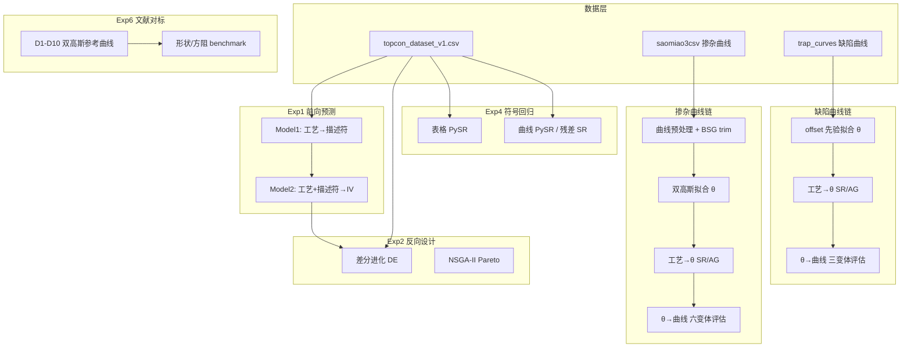

# TOPCon 计算策略、代码与精度报告总索引

> 本文档汇总本仓库 **核心计算策略、执行流程、脚本路径、精度/对比报告** 的位置。  
> 根目录：`<repo>/topcon_experiments/`（`<repo>` = 本仓库根目录）
> 统一输出根：`topcon_experiments/outputs/`  
> 主数据表：`new_data/topcon_dataset_v1.csv`（约 10159 行 × 50 列）

---

## 1. 核心计算策略（一句话）

在 **Athena 8 维工艺参数** 与 **器件级描述符/曲线** 之间建立可解释、可反演的机器学习桥梁：

```text
工艺参数 (athena_*)
    ├─ Exp1 前向：工艺 → 曲线描述符 → IV (Voc/Jsc/FF/PCE)
    ├─ Exp2 反向：DE/NSGA-II 最大化目标性能 → 最优工艺配方
    │
    ├─ 掺杂链：双高斯 N_DG(z;θ) [× exp(r_SR)]，θ=(N_p,z_p,z_f1,z_f2)
    │         工艺 → θ（GBM / PySR / AutoGluon）→ 曲线
    │
    ├─ 缺陷链：offset 先验 N=Nb+(Ns-Nb)exp(-z/L)，L>0
    │         工艺 → θ=(ln_Ns,ln_Nb,ln_L) → 曲线
    │
    └─ Exp4 PySR：表格/曲线/残差多线符号回归 + Exp6 文献对标
```

**Arrhenius 热预算特征**（`ln_dt1/2`, `ln_dtsum`, `frac_dt2` 等，\(E_a\in\{2.0,3.5\}\) eV）在工艺→θ 阶段追加，作为有效 \(Dt\) 代理，**不是**物理硼扩散系数本身。

---

## 2. 总体流程图



---

## 3. 分阶段：脚本 · 输出 · 精度报告

### 3.1 公共模块与配置

| 文件 | 路径 | 作用 |
|------|------|------|
| 全局配置 | `topcon_experiments/config.py` | 特征列、路径、DE/SR 超参、`OUTPUT_ROOT` |
| 数据加载 | `topcon_experiments/common/data.py` | `load_raw_dataframe()`, `preprocess_model1/2()` |
| 前向链 | `topcon_experiments/common/forward.py` | `ForwardChain`（DE/NSGA 调用） |
| 指标 | `topcon_experiments/common/metrics.py` | RMSE/MAE/R² 统一计算 |
| 绘图 | `topcon_experiments/common/plot_utils.py` | 散点图、trace、feature importance |
| 变量标签 | `topcon_experiments/common/variable_labels.py` | 论文/Origin 列名映射 |

---

### 3.2 Exp1 — 前向预测（工艺 → 性能）

| 阶段 | 脚本 | 输出目录 | 精度/对比报告 |
|------|------|----------|---------------|
| 训练 Model1/2 | `exp1_forward/train.py` | `outputs/exp1_forward/models/` | — |
| 评估 | `exp1_forward/evaluate.py` | `outputs/exp1_forward/` | **`metrics_model1.csv`**, **`metrics_model2.csv`** |
| 散点/重要性 | `exp1_forward/plot.py` | 同上 | `regression_scatter_merged*.csv`, `feature_importance_merged*.csv` |
| 合并导出 | `exp1_forward/merge_exports.py` | 同上 | 合并版 CSV |

**Model2 测试集精度（摘录）：**

| 目标 | test R² | test RMSE |
|------|---------|-----------|
| iv_Voc | 0.996 | 0.0023 V |
| iv_Jsc | 0.986 | 0.87 mA/cm² |
| iv_FF | 0.956 | 0.21 % |
| iv_Eff (PCE) | 0.989 | 0.52 % |

**特征重要性（四目标合并）：**  
`outputs/fig3_extension/feature_importance_Voc_Jsc_FF_PCE_raw.csv`  
`outputs/fig3_extension/feature_importance_Voc_Jsc_FF_PCE_normalized.csv`（逐列非负归一化）

---

### 3.3 Exp2 — 反向设计

| 阶段 | 脚本 | 输出目录 | 精度/对比报告 |
|------|------|----------|---------------|
| 单目标 DE | `exp2_inverse/de_single.py` | `outputs/exp2_inverse/` | **`de_best_iv_{Voc,Jsc,FF,Eff}.csv`**, `de_trace_iv_*.csv/png` |
| 快速单目标 | `exp2_inverse/de_one.py` | 同上 | 同上（单 metric） |
| 多目标 Pareto | `exp2_inverse/pareto_multi.py` | 同上 | **`pareto_front.csv`**, `pareto_best_compromise.csv` |
| 汇总报告 | `exp2_inverse/oracle_report.py` | 同上 | **`inverse_design_report.csv`**, `inverse_design_feasibility.csv`, `inverse_design_envelope.csv` |
| Fig.3 扩展图 | `exp2_inverse/plot_fig3_extension.py` | `outputs/fig3_extension/` | 工艺分布、学习曲线、DE 最优 z-score；见 `README.md` |

**DE 最优工艺偏离图数据：** `outputs/fig3_extension/C2_optimal_param_zscore.csv`

---

### 3.4 Exp3 — 效率分类与 SHAP

| 阶段 | 脚本 | 输出目录 | 精度/对比报告 |
|------|------|----------|---------------|
| 分档训练/评估 | `exp3_classifier/train_tiers.py`, `evaluate_tiers.py` | `outputs/exp3_classifier/tier_shap/` | **`tier_classification_metrics.csv`**, `efficiency_tier_definition.csv` |
| SHAP | `exp3_classifier/shap_analysis.py` | 同上 | beeswarm/dependence 图 + CSV |

---

### 3.5 掺杂曲线链（双高斯 + 工艺→θ + 六变体）

#### 3.5.1 方法与公式

| 内容 | 路径 |
|------|------|
| 双高斯形状 | 文献非对称双高斯：\(N_p,z_p,z_f1,z_f2\)；实现见 `exp6_experimental/literature_benchmark/fit_double_gaussian_to_sim.py` |
| BSG 自适应裁窗 | `exp4_symbolic/curve_bsg_trim.py`（cliff→knee→valley，避免 over-trim） |
| 评估窗口 | BSG-trim 后 **N ≥ 1e18 cm⁻³** 段；指标 **R²_log / RMSE_log**（log10） |
| 六变体说明 | `outputs/paper_package_six_variants/00_readme.md` |

**六变体 id：**

| id | 含义 |
|----|------|
| `dg_selffit` / `dgresid_selffit` | θ 来自曲线自拟合 |
| `dg_sr` / `dgresid_sr` | θ 来自工艺 PySR |
| `dg_ag` / `dgresid_ag` | θ 来自 AutoGluon |

#### 3.5.2 脚本与输出

| 阶段 | 脚本 | 输出目录 | 精度/对比报告 |
|------|------|----------|---------------|
| 曲线预处理 | `exp4_symbolic/preprocess_curves.py` | `outputs/exp4_symbolic/` | `curve_processed_doping_ext10000_adaptive.csv` 等 |
| 工艺→DG GBM 链 | `exp4_symbolic/run_process_to_dg_chain.py` | `outputs/exp4_symbolic/process_to_dg/` | **`data/stage1_metrics.csv`**, **`chain_summary.csv`**, `chain_eval.csv`, **`data/dg_params_ext.csv`** |
| 工艺→θ PySR | `exp4_symbolic/run_process_to_theta_sr.py` | `outputs/exp4_symbolic/process_to_theta_sr/` | **`theta_sr_summary.csv`**, `sr_formulas_theta_*.csv` |
| 工艺→θ AutoGluon | `exp4_symbolic/run_theta_autogluon.py` | 同上 | **`data/theta_autogluon_metrics.csv`**, `data/autogluon_chain_summary.csv` |
| 全符号链评估 | `exp4_symbolic/eval_symbolic_chain_on_sim.py` | 同上 | **`data/symbolic_chain_summary.csv`**, `symbolic_chain_eval.csv` |
| 双高斯先验+残差 SR 实验 | `exp4_symbolic/run_curve_prior_sr_experiment.py` | `outputs/exp4_symbolic/curve_prior_experiment/` | `data/dg_params.csv`, `sr_formulas_doping_*_full.csv` |
| 自适应 SR 实验 | `exp4_symbolic/run_curve_adaptive_sr_experiment.py` | `outputs/exp4_symbolic/curve_adaptive_experiment/` | **`adaptive_sr_metrics.csv`** |
| 六变体打包 | `exp4_symbolic/package_six_variant_results.py` | `outputs/paper_package_six_variants/` | 见 §4.1 |
| 掺杂误差分析 | `exp4_symbolic/package_doping_error_figures.py` | `outputs/paper_package_defect_and_doping_extras/01_doping_error_analysis/` | 见 §4.2 |

**仿真 test 集曲线精度（median R²_log，摘自 `simulation_curve_summary.csv`）：**

| 变体 | median R²_log |
|------|---------------|
| dg_selffit | **0.991** |
| dgresid_selffit | 0.989 |
| dg_ag | **0.953** |
| dg_sr | 0.884 |
| dgresid_sr / dgresid_ag | ~0.89 / ~0.94 |

**文献 D1–D10（仅 self-fit）：** dg_selffit R²_log = 1.0；dgresid_selffit median ≈ 0.998

---

### 3.6 缺陷曲线链（offset 先验 + 工艺→θ）

| 内容 | 路径 |
|------|------|
| **方法全文（中文）** | **`outputs/paper_package_defect_and_doping_extras/02_defect_pipeline/METHOD.md`** |
| 先验实现 | `exp4_symbolic/defect_shape_prior.py` |
| 工艺→θ 主脚本 | `exp4_symbolic/run_process_to_defect_theta.py` |
| 工作缓存 | `outputs/exp4_symbolic/process_to_defect_theta/` |
| 论文打包 | `outputs/paper_package_defect_and_doping_extras/02_defect_pipeline/` |

| 阶段 | 关键输出 | 精度/对比报告 |
|------|----------|---------------|
| 曲线预处理 | `curve_processed_defect_ext2000.csv` | — |
| 先验拟合 | `process_to_defect_theta/data/defect_prior_params_v2.csv` | 每样本 `r2_ln` |
| 工艺→θ SR | `sr_formulas_defect_theta_v2_{ln_Ns,ln_Nb,ln_L}.csv` | **`data/theta_sr_summary_v2.csv`** |
| 工艺→θ AG | `autogluon_models_v2/` | **`data/theta_autogluon_metrics_v2.csv`** |
| 曲线链评估 | `02_defect_pipeline/summaries/` | **`defect_curve_summary.csv`**（主指标 **`pooled_r2_ln`**） |

**缺陷链 test 集 pooled R²_ln（摘自 METHOD / summary）：**

| 模型 | pooled R²_ln |
|------|--------------|
| Legacy 全曲线 SR（基线） | 0.801 |
| prior_selffit | ~0.998 |
| prior_ag | **~0.948** |
| prior_sr | ~0.59 |

---

### 3.7 掺杂 + 缺陷联合 per-sample 指标

| 脚本 | 输出目录 | 文件 |
|------|----------|------|
| `exp4_symbolic/eval_joint_doping_defect_metrics.py` | `outputs/paper_package_defect_and_doping_extras/03_joint_metrics/` | **`joint_metrics_original.csv`**（2000 行） |
| | | **`joint_metrics_preprocessed.csv`**（1029 行，QC 后） |
| | | **`joint_metrics_summary.csv`** |
| | | **`filter_rules.md`**（过滤规则说明） |

每行 = 一个 `file_base`；列 = 掺杂 6 变体 + 缺陷 3 变体 的 R² / RMSE。

---

### 3.8 Exp4 — 符号回归（表格 / 曲线 / 报告）

| 阶段 | 脚本 | 输出 | 精度报告 |
|------|------|------|----------|
| 曲线 SR | `exp4_symbolic/run_symbolic.py` | `outputs/exp4_symbolic/sr_formulas_{doping,defect}.csv` | — |
| 表格 SR | `run_symbolic_tabular.py`, `run_symbolic_tabular_iv_full.py` | `sr_tabular_*.csv` | — |
| 尾部窗口 SR | `run_curve_tail_sr_experiment.py` | `curve_tail_experiment/` | **`tail_sr_metrics.csv`** |
| FF 评估 | `evaluate_ff_from_predicted_iv.py` | `exp4_symbolic/` | `sr_ff_from_predicted_iv_metrics.csv` |
| SR 精度图 | `plot_sr_accuracy.py` | `sr_plots/` | **`sr_scatter_metrics.csv`** |
| SR 总报告索引 | `generate_sr_report.py` | **`outputs/exp4_symbolic/symbolic_regression_report.md`** | 链接至 `sr_reports/*.md`（约 20+ 任务） |
| LLM 公式分析 | `analyze_theta_formulas_with_llm.py` 等 | `process_to_theta_sr/theta_llm_analysis.md`, `paper_package_six_variants/05_llm_reports/` | — |

**SR 完整流水线入口：** `topcon_experiments/run_sr_full.py`（含 LLM）  
**无 LLM 版：** `run_sr_regression.py`

---

### 3.9 Exp5 — 相关性分析

| 脚本 | 输出 | 报告 |
|------|------|------|
| `exp5_correlation/run_correlation_analysis.py` | `outputs/exp5_correlation/data/` | `pearson_*.csv`, `semantic_*.csv`, `llm_text_summary.csv` |
| 入口 | `run_exp5_correlation.py` | — |

---

### 3.10 Exp6 — 文献 benchmark

| 内容 | 路径 |
|------|------|
| **对标策略文档** | **`exp6_experimental/literature_benchmark/benchmark_strategy.md`** |
| 文献参数提取 | `extract_literature_info/summary.md`, `full_table.csv` |
| 双高斯参考曲线 | `exp6_experimental/run_literature_double_gaussian.py` → `exp6_experimental/outputs/literature_double_gaussian/data/curves/D*_doping_curve.csv` |
| 文献 SR 拟合 | `literature_benchmark/fit_sr_to_literature.py` | `literature_benchmark/data/benchmark_feasibility_merged.csv`, `curve_shape_fit_summary.csv`, `r_sheet_fit_summary.csv` |
| DG vs SR 仿真对比 | `compare_dg_vs_sr_on_sim.py` | `dg_vs_sr_on_sim/data/dg_vs_sr_summary.csv` |
| 先验 SR 仿真评估 | `eval_prior_sr_on_sim.py` | `prior_sr_eval/data/prior_sr_summary.csv` |
| 总入口 | `exp6_experimental/run_literature_benchmark.py` | — |

---

## 4. 论文打包目录（精度图表 + Origin 数据）

### 4.1 六变体掺杂包 — `outputs/paper_package_six_variants/`

| 子目录 | 内容 | 关键精度文件 |
|--------|------|--------------|
| `01_literature/` | D1–D10 overlay（仅 self-fit） | `per_profile_metrics.csv`, `04_summaries/literature_curve_summary.csv` |
| `02_simulation_best10/` | test top-10，六变体 overlay | Origin CSV |
| `03_process_layer_theta/` | 工艺→θ 散点 | `theta_metrics_summary.csv` |
| **`04_summaries/`** | **汇总表** | **`simulation_curve_summary.csv`**, `simulation_test_per_sample.csv`, **`curve_prediction_overview.csv`** |
| `05_llm_reports/` | θ-SR、DG 残差 LLM 解读 | `*.md`, `*.csv` |

### 4.2 缺陷 + 掺杂扩展包 — `outputs/paper_package_defect_and_doping_extras/`

| 子目录 | 内容 | 关键精度文件 |
|--------|------|--------------|
| **`01_doping_error_analysis/`** | 六变体 R² 箱线、θ 传播、best/worst overlay | **`summaries/six_variant_r2_quantiles.csv`**, `theta_error_vs_curve_r2.csv` |
| **`02_defect_pipeline/`** | 缺陷链完整产物 + **METHOD.md** | **`summaries/defect_curve_summary.csv`**, `defect_curve_per_sample.csv`, `process_layer_theta_summary.csv` |
| **`03_joint_metrics/`** | 掺杂+缺陷联合 per-sample | **`joint_metrics_*.csv`**, `joint_metrics_summary.csv` |

说明文档：`00_readme.md`（本包根目录）

### 4.3 Fig.3 扩展 — `outputs/fig3_extension/`

见 `README.md`：工艺高低 PCE 分布、GBM 学习曲线、feature importance、DE 最优 z-score 等。

---

## 5. 总入口脚本

| 脚本 | 路径 | 包含范围 |
|------|------|----------|
| **`run_all.py`** | `topcon_experiments/run_all.py` | Exp1→Exp2→Exp3→Exp4 基础 SR→Exp5；**不含** process_to_dg / defect / paper package |
| `run_sr_full.py` | `topcon_experiments/run_sr_full.py` | PySR 全流水线 + FF + LLM + SR 报告 |
| `run_sr_regression.py` | 同上目录 | SR 无 LLM |
| `run_literature_benchmark.py` | `exp6_experimental/` | 文献对标 |

---

## 6. 推荐复现顺序（论文级完整链）

```bash
# 工作目录：本仓库根目录（`<repo>`，即包含 topcon_experiments/ 与 new_data/ 的那一层）

# A. 前向 + 反向（可选 run_all 前半）
python -m topcon_experiments.exp1_forward.train
python -m topcon_experiments.exp1_forward.evaluate
python -m topcon_experiments.exp1_forward.plot
python -m topcon_experiments.exp2_inverse.de_single

# B. 掺杂链
python -m topcon_experiments.exp4_symbolic.preprocess_curves          # 若曲线 CSV 不存在
python -m topcon_experiments.exp4_symbolic.run_process_to_dg_chain
python -m topcon_experiments.exp4_symbolic.run_process_to_theta_sr
python -m topcon_experiments.exp4_symbolic.run_theta_autogluon
python -m topcon_experiments.exp4_symbolic.eval_symbolic_chain_on_sim
python -m topcon_experiments.exp4_symbolic.package_six_variant_results

# C. 缺陷链
python -m topcon_experiments.exp4_symbolic.run_process_to_defect_theta

# D. 误差分析 + 联合指标
python -m topcon_experiments.exp4_symbolic.package_doping_error_figures
python -m topcon_experiments.exp4_symbolic.eval_joint_doping_defect_metrics

# E. Fig.3 扩展（可选）
python -m topcon_experiments.exp2_inverse.plot_fig3_extension

# F. 文献 benchmark（可选）
python -m topcon_experiments.exp6_experimental.run_literature_benchmark
```

---

## 7. 精度对比报告速查表

| 报告主题 | 文件路径 |
|----------|----------|
| **前向 Model1/2 指标** | `outputs/exp1_forward/metrics_model1.csv`, `metrics_model2.csv` |
| **反向设计汇总** | `outputs/exp2_inverse/inverse_design_report.csv` |
| **工艺→DG stage1** | `outputs/exp4_symbolic/process_to_dg/data/stage1_metrics.csv`, `chain_summary.csv` |
| **工艺→θ 掺杂 SR/AG** | `outputs/exp4_symbolic/process_to_theta_sr/theta_sr_summary.csv`, `data/theta_autogluon_metrics.csv`, `data/symbolic_chain_summary.csv` |
| **六变体仿真曲线** | `outputs/paper_package_six_variants/04_summaries/simulation_curve_summary.csv` |
| **六变体文献曲线** | `outputs/paper_package_six_variants/04_summaries/literature_curve_summary.csv` |
| **六变体总览** | `outputs/paper_package_six_variants/04_summaries/curve_prediction_overview.csv` |
| **掺杂 R² 分位数** | `outputs/paper_package_defect_and_doping_extras/01_doping_error_analysis/summaries/six_variant_r2_quantiles.csv` |
| **缺陷曲线 pooled R²** | `outputs/paper_package_defect_and_doping_extras/02_defect_pipeline/summaries/defect_curve_summary.csv` |
| **缺陷工艺→θ** | `outputs/exp4_symbolic/process_to_defect_theta/data/theta_sr_summary_v2.csv`, `theta_autogluon_metrics_v2.csv` |
| **掺杂+缺陷联合** | `outputs/paper_package_defect_and_doping_extras/03_joint_metrics/joint_metrics_summary.csv` |
| **SR 实验对比** | `outputs/exp4_symbolic/curve_tail_experiment/tail_sr_metrics.csv`, `curve_adaptive_experiment/adaptive_sr_metrics.csv`, `sr_plots/sr_scatter_metrics.csv` |
| **文献 benchmark** | `exp6_experimental/outputs/literature_benchmark/data/benchmark_feasibility_merged.csv` |
| **DG vs SR 仿真** | `exp6_experimental/outputs/dg_vs_sr_on_sim/data/dg_vs_sr_summary.csv` |
| **IV 四目标 feature importance** | `outputs/fig3_extension/feature_importance_Voc_Jsc_FF_PCE_{raw,normalized}.csv` |

---

## 8. 相关文档（非 outputs）

| 文档 | 路径 | 说明 |
|------|------|------|
| 本索引 | **`topcon_experiments/COMPUTATION_INDEX.md`** | 策略 + 代码 + 报告总表 |
| 缺陷方法 | `outputs/.../02_defect_pipeline/METHOD.md` | 缺陷链公式与评估口径 |
| 文献对标策略 | `exp6_experimental/literature_benchmark/benchmark_strategy.md` | 三层对标 |
| 项目研究总结 | `docs/Summary.md` | Fig.1–7 叙事 |
| 补充方法（英文） | `docs/Supplementary_Methods.md` | 方法学附录 |
| 仓库总 README | `readme.md` | 全仓库结构 |

---

## 9. 评估口径备忘

| 任务 | 指标 | 评估域 |
|------|------|--------|
| 掺杂曲线 | R²_log, RMSE_log | BSG-trim + **N≥1e18** |
| 缺陷曲线 | R²_ln, RMSE_ln, **pooled R²_ln** | 全深度正浓度 |
| 前向 IV | R², RMSE（原尺度） | 随机 8:2 test split |
| 工艺→θ | R², RMSE（θ 空间） | 同上 split |
| 联合表 QC | 见 `03_joint_metrics/filter_rules.md` | 自拟合质量 + 数值 sanity |

---

*最后更新：与当前 `paper_package_*`、`process_to_*`、`eval_joint_*` 脚本及 outputs 目录一致。*
